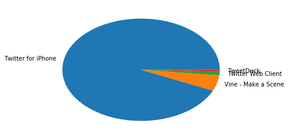

## 数据分析和可视化

    在wrangle_act.ipynb中，我们已经处理了tweet_json.txt和twitter-archive-enhanced.csv的数据，且生成到twitter_archive_master.csv文件中。


```python
# -*- coding=utf-8 -*-
%matplotlib inline
import pandas as pd
import matplotlib.pyplot as plt

# 读取twitter_archive_master.csv
twitter_archive_master = pd.read_csv("twitter_archive_master.csv")
twitter_archive_master.info()
twitter_archive_master.head(3)
```

    <class 'pandas.core.frame.DataFrame'>
    RangeIndex: 1438 entries, 0 to 1437
    Data columns (total 14 columns):
    tweet_id              1438 non-null int64
    name                  1438 non-null object
    rating_numerator      1438 non-null int64
    rating_denominator    1438 non-null int64
    timestamp             1438 non-null object
    text                  1438 non-null object
    source_text           1438 non-null object
    expanded_urls_one     1398 non-null object
    doggo                 1438 non-null object
    floofer               1438 non-null object
    pupper                1438 non-null object
    puppo                 1438 non-null object
    retweet_count         890 non-null float64
    favorite_count        890 non-null float64
    dtypes: float64(2), int64(3), object(9)
    memory usage: 157.4+ KB
    


<div>
<style>
    .dataframe thead tr:only-child th {
        text-align: right;
    }

    .dataframe thead th {
        text-align: left;
    }

    .dataframe tbody tr th {
        vertical-align: top;
    }
</style>
<table border="1" class="dataframe">
  <thead>
    <tr style="text-align: right;">
      <th></th>
      <th>tweet_id</th>
      <th>name</th>
      <th>rating_numerator</th>
      <th>rating_denominator</th>
      <th>timestamp</th>
      <th>text</th>
      <th>source_text</th>
      <th>expanded_urls_one</th>
      <th>doggo</th>
      <th>floofer</th>
      <th>pupper</th>
      <th>puppo</th>
      <th>retweet_count</th>
      <th>favorite_count</th>
    </tr>
  </thead>
  <tbody>
    <tr>
      <th>0</th>
      <td>892420643555336193</td>
      <td>Phineas</td>
      <td>13</td>
      <td>10</td>
      <td>2017-08-01 16:23:56</td>
      <td>This is Phineas. He's a mystical boy. Only eve...</td>
      <td>Twitter for iPhone</td>
      <td>https://twitter.com/dog_rates/status/892420643...</td>
      <td>None</td>
      <td>None</td>
      <td>None</td>
      <td>None</td>
      <td>NaN</td>
      <td>NaN</td>
    </tr>
    <tr>
      <th>1</th>
      <td>892177421306343426</td>
      <td>Tilly</td>
      <td>13</td>
      <td>10</td>
      <td>2017-08-01 00:17:27</td>
      <td>This is Tilly. She's just checking pup on you....</td>
      <td>Twitter for iPhone</td>
      <td>https://twitter.com/dog_rates/status/892177421...</td>
      <td>None</td>
      <td>None</td>
      <td>None</td>
      <td>None</td>
      <td>NaN</td>
      <td>NaN</td>
    </tr>
    <tr>
      <th>2</th>
      <td>891815181378084864</td>
      <td>Archie</td>
      <td>12</td>
      <td>10</td>
      <td>2017-07-31 00:18:03</td>
      <td>This is Archie. He is a rare Norwegian Pouncin...</td>
      <td>Twitter for iPhone</td>
      <td>https://twitter.com/dog_rates/status/891815181...</td>
      <td>None</td>
      <td>None</td>
      <td>None</td>
      <td>None</td>
      <td>4301.0</td>
      <td>25445.0</td>
    </tr>
  </tbody>
</table>
</div>


```python
twitter_archive_master.describe()
```


<div>
<style>
    .dataframe thead tr:only-child th {
        text-align: right;
    }

    .dataframe thead th {
        text-align: left;
    }

    .dataframe tbody tr th {
        vertical-align: top;
    }
</style>
<table border="1" class="dataframe">
  <thead>
    <tr style="text-align: right;">
      <th></th>
      <th>tweet_id</th>
      <th>rating_numerator</th>
      <th>rating_denominator</th>
      <th>retweet_count</th>
      <th>favorite_count</th>
    </tr>
  </thead>
  <tbody>
    <tr>
      <th>count</th>
      <td>1.438000e+03</td>
      <td>1438.000000</td>
      <td>1438.0</td>
      <td>890.000000</td>
      <td>890.000000</td>
    </tr>
    <tr>
      <th>mean</th>
      <td>7.706092e+17</td>
      <td>14.479833</td>
      <td>10.0</td>
      <td>4020.047191</td>
      <td>10822.894382</td>
    </tr>
    <tr>
      <th>std</th>
      <td>6.864808e+16</td>
      <td>52.108159</td>
      <td>0.0</td>
      <td>5617.016301</td>
      <td>13021.128657</td>
    </tr>
    <tr>
      <th>min</th>
      <td>6.661022e+17</td>
      <td>11.000000</td>
      <td>10.0</td>
      <td>2.000000</td>
      <td>0.000000</td>
    </tr>
    <tr>
      <th>25%</th>
      <td>7.031264e+17</td>
      <td>11.000000</td>
      <td>10.0</td>
      <td>1028.500000</td>
      <td>2381.000000</td>
    </tr>
    <tr>
      <th>50%</th>
      <td>7.774056e+17</td>
      <td>12.000000</td>
      <td>10.0</td>
      <td>2304.000000</td>
      <td>6398.500000</td>
    </tr>
    <tr>
      <th>75%</th>
      <td>8.283699e+17</td>
      <td>13.000000</td>
      <td>10.0</td>
      <td>4899.500000</td>
      <td>14694.500000</td>
    </tr>
    <tr>
      <th>max</th>
      <td>8.924206e+17</td>
      <td>1776.000000</td>
      <td>10.0</td>
      <td>56373.000000</td>
      <td>106634.000000</td>
    </tr>
  </tbody>
</table>
</div>


#### 通过上面的describe()可以得知，retweet_count的最大值是56373，favorite_count的最大值是106634，平均分值约为14.48。它们是哪些小狗的推文产生的呢？


```python
twitter_archive_master[twitter_archive_master.retweet_count==56373]
```


<div>
<style>
    .dataframe thead tr:only-child th {
        text-align: right;
    }

    .dataframe thead th {
        text-align: left;
    }

    .dataframe tbody tr th {
        vertical-align: top;
    }
</style>
<table border="1" class="dataframe">
  <thead>
    <tr style="text-align: right;">
      <th></th>
      <th>tweet_id</th>
      <th>name</th>
      <th>rating_numerator</th>
      <th>rating_denominator</th>
      <th>timestamp</th>
      <th>text</th>
      <th>source_text</th>
      <th>expanded_urls_one</th>
      <th>doggo</th>
      <th>floofer</th>
      <th>pupper</th>
      <th>puppo</th>
      <th>retweet_count</th>
      <th>favorite_count</th>
    </tr>
  </thead>
  <tbody>
    <tr>
      <th>254</th>
      <td>842892208864923648</td>
      <td>Stephan</td>
      <td>13</td>
      <td>10</td>
      <td>2017-03-18 00:15:37</td>
      <td>RT @dog_rates: This is Stephan. He just wants ...</td>
      <td>Twitter for iPhone</td>
      <td>https://twitter.com/dog_rates/status/807106840...</td>
      <td>None</td>
      <td>None</td>
      <td>None</td>
      <td>None</td>
      <td>56373.0</td>
      <td>0.0</td>
    </tr>
    <tr>
      <th>508</th>
      <td>807106840509214720</td>
      <td>Stephan</td>
      <td>13</td>
      <td>10</td>
      <td>2016-12-09 06:17:20</td>
      <td>This is Stephan. He just wants to help. 13/10 ...</td>
      <td>Twitter for iPhone</td>
      <td>https://twitter.com/dog_rates/status/807106840...</td>
      <td>None</td>
      <td>None</td>
      <td>None</td>
      <td>None</td>
      <td>56373.0</td>
      <td>106634.0</td>
    </tr>
  </tbody>
</table>
</div>


```python
twitter_archive_master[twitter_archive_master.favorite_count==106634]
```


<div>
<style>
    .dataframe thead tr:only-child th {
        text-align: right;
    }

    .dataframe thead th {
        text-align: left;
    }

    .dataframe tbody tr th {
        vertical-align: top;
    }
</style>
<table border="1" class="dataframe">
  <thead>
    <tr style="text-align: right;">
      <th></th>
      <th>tweet_id</th>
      <th>name</th>
      <th>rating_numerator</th>
      <th>rating_denominator</th>
      <th>timestamp</th>
      <th>text</th>
      <th>source_text</th>
      <th>expanded_urls_one</th>
      <th>doggo</th>
      <th>floofer</th>
      <th>pupper</th>
      <th>puppo</th>
      <th>retweet_count</th>
      <th>favorite_count</th>
    </tr>
  </thead>
  <tbody>
    <tr>
      <th>508</th>
      <td>807106840509214720</td>
      <td>Stephan</td>
      <td>13</td>
      <td>10</td>
      <td>2016-12-09 06:17:20</td>
      <td>This is Stephan. He just wants to help. 13/10 ...</td>
      <td>Twitter for iPhone</td>
      <td>https://twitter.com/dog_rates/status/807106840...</td>
      <td>None</td>
      <td>None</td>
      <td>None</td>
      <td>None</td>
      <td>56373.0</td>
      <td>106634.0</td>
    </tr>
  </tbody>
</table>
</div>


可以推测这个创造最大的转发量、收藏量的小狗Stephan，很可能是同一条小狗，可以通过expanded_urls_one确认下。

#### 这些推文，通过什么渠道发出的？我们通过source_text来分析下：


```python
twitter_archive_master.source_text.value_counts()
```


    Twitter for iPhone     1342
    Vine - Make a Scene      71
    Twitter Web Client       17
    TweetDeck                 8
    Name: source_text, dtype: int64


```python
# 画图
plt.pie(by_source, labels=['Twitter for iPhone', 'Vine - Make a Scene', 'Twitter Web Client', 'TweetDeck'])
```


    ([<matplotlib.patches.Wedge at 0xb7be860>,
      <matplotlib.patches.Wedge at 0xbecf710>,
      <matplotlib.patches.Wedge at 0xb555978>,
      <matplotlib.patches.Wedge at 0xb069828>],
     [<matplotlib.text.Text at 0xbecf9b0>,
      <matplotlib.text.Text at 0xbecfcf8>,
      <matplotlib.text.Text at 0xb555e80>,
      <matplotlib.text.Text at 0xb069630>])





可以得知Twitter for iPhone渠道的推特数据是最多的。

#### 小狗的历史最高分值排名是怎么样的？（这里用name值来区别小狗）


```python
# 按照name分组后，求 rating_numerator 的最大值
names = twitter_archive_master.groupby(['name'])['rating_numerator'].max()
names['None']=0
names.sort_values(ascending=False)[:9]
```


    name
    Atticus    1776
    Logan        75
    Sophie       27
    Smiley       14
    a            14
    Kuyu         14
    Cermet       14
    Iggy         14
    Doobert      14
    Name: rating_numerator, dtype: int64


通过上面的结果得知(None没有名字的忽略)，分值排前3的狗分别是Atticus(1776/10)、Logan(75/10)、Sophie(27/10)
