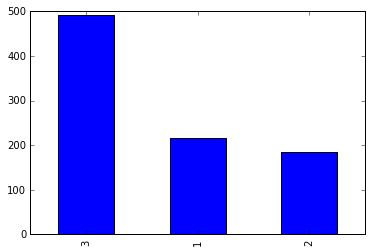
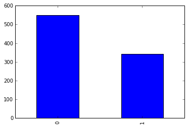

# 泰坦尼克号数据的分析项目

泰坦尼克号数据：包括泰坦尼克号上 2224 名乘客和船员中 891 名的人口学数据和乘客基本信息。这个数据集来自 Kaggle，该网站上能够查看这个数据集的详细描述。


```python
# 引入 numpy 和 pandas 模块
%matplotlib inline
import numpy as np
import pandas as pd
```


```python
titanic_data = pd.DataFrame(pd.read_csv('titanic-data.csv'))
# 查看下数据样本的相关信息
titanic_data.info()
```

    <class 'pandas.core.frame.DataFrame'>
    RangeIndex: 891 entries, 0 to 890
    Data columns (total 12 columns):
    PassengerId    891 non-null int64
    Survived       891 non-null int64
    Pclass         891 non-null int64
    Name           891 non-null object
    Sex            891 non-null object
    Age            714 non-null float64
    SibSp          891 non-null int64
    Parch          891 non-null int64
    Ticket         891 non-null object
    Fare           891 non-null float64
    Cabin          204 non-null object
    Embarked       889 non-null object
    dtypes: float64(2), int64(5), object(5)
    memory usage: 83.6+ KB
    


```python
# 查看下数据样本的前3行数据
titanic_data.head(3)
```


<div>
<table border="1" class="dataframe">
  <thead>
    <tr style="text-align: right;">
      <th></th>
      <th>PassengerId</th>
      <th>Survived</th>
      <th>Pclass</th>
      <th>Name</th>
      <th>Sex</th>
      <th>Age</th>
      <th>SibSp</th>
      <th>Parch</th>
      <th>Ticket</th>
      <th>Fare</th>
      <th>Cabin</th>
      <th>Embarked</th>
    </tr>
  </thead>
  <tbody>
    <tr>
      <th>0</th>
      <td>1</td>
      <td>0</td>
      <td>3</td>
      <td>Braund, Mr. Owen Harris</td>
      <td>male</td>
      <td>22.0</td>
      <td>1</td>
      <td>0</td>
      <td>A/5 21171</td>
      <td>7.2500</td>
      <td>NaN</td>
      <td>S</td>
    </tr>
    <tr>
      <th>1</th>
      <td>2</td>
      <td>1</td>
      <td>1</td>
      <td>Cumings, Mrs. John Bradley (Florence Briggs Th...</td>
      <td>female</td>
      <td>38.0</td>
      <td>1</td>
      <td>0</td>
      <td>PC 17599</td>
      <td>71.2833</td>
      <td>C85</td>
      <td>C</td>
    </tr>
    <tr>
      <th>2</th>
      <td>3</td>
      <td>1</td>
      <td>3</td>
      <td>Heikkinen, Miss. Laina</td>
      <td>female</td>
      <td>26.0</td>
      <td>0</td>
      <td>0</td>
      <td>STON/O2. 3101282</td>
      <td>7.9250</td>
      <td>NaN</td>
      <td>S</td>
    </tr>
  </tbody>
</table>
</div>


    # 数据集的字段注释
    PassengerId => 乘客ID
    Survived => 存活(0存活、1死亡)
    Pclass => 乘客等级(1/2/3等舱位)
    Name => 乘客姓名
    Sex => 性别
    Age => 年龄
    SibSp => 堂兄弟/妹个数
    Parch => 父母与小孩个数
    Ticket => 船票信息
    Fare => 票价
    Cabin => 客舱
    Embarked => 登船港口


```python
# 查看数据集的 统计汇总
titanic_data.describe()
```


<div>
<table border="1" class="dataframe">
  <thead>
    <tr style="text-align: right;">
      <th></th>
      <th>PassengerId</th>
      <th>Survived</th>
      <th>Pclass</th>
      <th>Age</th>
      <th>SibSp</th>
      <th>Parch</th>
      <th>Fare</th>
    </tr>
  </thead>
  <tbody>
    <tr>
      <th>count</th>
      <td>891.000000</td>
      <td>891.000000</td>
      <td>891.000000</td>
      <td>714.000000</td>
      <td>891.000000</td>
      <td>891.000000</td>
      <td>891.000000</td>
    </tr>
    <tr>
      <th>mean</th>
      <td>446.000000</td>
      <td>0.383838</td>
      <td>2.308642</td>
      <td>29.699118</td>
      <td>0.523008</td>
      <td>0.381594</td>
      <td>32.204208</td>
    </tr>
    <tr>
      <th>std</th>
      <td>257.353842</td>
      <td>0.486592</td>
      <td>0.836071</td>
      <td>14.526497</td>
      <td>1.102743</td>
      <td>0.806057</td>
      <td>49.693429</td>
    </tr>
    <tr>
      <th>min</th>
      <td>1.000000</td>
      <td>0.000000</td>
      <td>1.000000</td>
      <td>0.420000</td>
      <td>0.000000</td>
      <td>0.000000</td>
      <td>0.000000</td>
    </tr>
    <tr>
      <th>25%</th>
      <td>223.500000</td>
      <td>0.000000</td>
      <td>2.000000</td>
      <td>NaN</td>
      <td>0.000000</td>
      <td>0.000000</td>
      <td>7.910400</td>
    </tr>
    <tr>
      <th>50%</th>
      <td>446.000000</td>
      <td>0.000000</td>
      <td>3.000000</td>
      <td>NaN</td>
      <td>0.000000</td>
      <td>0.000000</td>
      <td>14.454200</td>
    </tr>
    <tr>
      <th>75%</th>
      <td>668.500000</td>
      <td>1.000000</td>
      <td>3.000000</td>
      <td>NaN</td>
      <td>1.000000</td>
      <td>0.000000</td>
      <td>31.000000</td>
    </tr>
    <tr>
      <th>max</th>
      <td>891.000000</td>
      <td>1.000000</td>
      <td>3.000000</td>
      <td>80.000000</td>
      <td>8.000000</td>
      <td>6.000000</td>
      <td>512.329200</td>
    </tr>
  </tbody>
</table>
</div>


### 从以上的统计汇总信息中，可以得出以下结论：
- Age、Cabin、Embarked的数据有缺失
- Survived.mean=0.38，Survived的值为1或0，所以这次事故中乘客的存活率为0.38
- Age.min最小年龄的乘客不到1岁，而Age.max最大年龄的乘客为80岁，乘客平均年龄为29岁
- Pclass.mean=2.3，舱位分为1/2/3等，而mean大于2，所以2、3等舱位数量最多

### 针对该数据样本提出的问题
- a1.舱位1/2/3等，分别个是多少？
- 答：1/2/3等舱位数量分别为216、184、491。
- a2.年龄最小不到1岁的乘客和年龄最大80岁的乘客，他们是否在事故中幸存下来？
- 答：年龄最大和最小的两位乘客在那次事故中幸存。


```python
# 定一个计数函数
def count_class(data, class_name):
    return data[data==class_name].count()

# a1.舱位1/2/3等，分别个是多少？
titanic_data_Pclass = titanic_data['Pclass']

print "Pclass1:", count_class(titanic_data_Pclass, 1)
print "Pclass2:", count_class(titanic_data_Pclass, 2)
print "Pclass3:", count_class(titanic_data_Pclass, 3)

titanic_data.Pclass.value_counts().plot(kind="bar")
```

    Pclass1: 216
    Pclass2: 184
    Pclass3: 491
    


    <matplotlib.axes._subplots.AxesSubplot at 0xbbcf2b0>





```python
# a2.年龄最小不到1岁的乘客和年龄最大80岁的乘客，他们是否在事故中幸存下来？
age_for_min = titanic_data['Age'].argmin()
age_for_max = titanic_data['Age'].argmax()
# print age_for_min, age_for_max
age_min_Survived = titanic_data.iloc[[age_for_min]]
age_max_Survived = titanic_data.iloc[[age_for_max]]
print age_min_Survived['Survived']
print age_max_Survived['Survived']
```

    803    1
    Name: Survived, dtype: int64
    630    1
    Name: Survived, dtype: int64
    

### 提出新的问题
- b1.乘客的获救情况？
- 答：891名乘客中，有342名乘客获救，549名成员在事故中遇难。
- b2.1/2/3等舱位分别的获救情况？
- 答：Pclass_1： 总数：216 存活：136 存活率：0.62962962963
-    Pclass_2： 总数：184 存活：87 存活率：0.472826086957
-    Pclass_3： 总数：491 存活：119 存活率：0.242362525458
- b3.乘客中男性和女性的的获救情况？
- 答：male： 总数：577 存活：109 存活率：0.188908145581
-    female： 总数：314 存活：233 存活率：0.742038216561


```python
# b1.乘客的获救情况？
print "Survived:", count_class(titanic_data['Survived'], 1)
print "Dead:", count_class(titanic_data['Survived'], 0)
titanic_data.Survived.value_counts().plot(kind="bar")
```

    Survived: 342
    Dead: 549
    


    <matplotlib.axes._subplots.AxesSubplot at 0xc0cdda0>





```python
# b2.1/2/3等舱位分别的获救情况？
plt.subplot2grid((1,3),(0,0))
plt.ylabel(u"people")
plt.title(u"Pclass_1")
titanic_data[titanic_data.Pclass==1].Survived.value_counts().plot(kind="bar")
plt.subplot2grid((1,3),(0,1))
plt.title(u"Pclass_2")
titanic_data[titanic_data.Pclass==2].Survived.value_counts().plot(kind="bar")
plt.subplot2grid((1,3),(0,2))
plt.title(u"Pclass_3")
titanic_data[titanic_data.Pclass==3].Survived.value_counts().plot(kind="bar")
```


    <matplotlib.axes._subplots.AxesSubplot at 0x10892d68>


```python
# 统计存活率
def count_Survived(data):
    data_all = data.Survived.count()
    data_Survived = data.Survived.value_counts()
    return "总数：{} 存活：{} 存活率：{}".format(data_all, data_Survived[1], 1.0 * data_Survived[1]/data_all)

print "Pclass_1：", count_Survived(titanic_data[titanic_data.Pclass==1])
print "Pclass_2：", count_Survived(titanic_data[titanic_data.Pclass==2])
print "Pclass_3：", count_Survived(titanic_data[titanic_data.Pclass==3])
```

    Pclass_1： 总数：216 存活：136 存活率：0.62962962963
    Pclass_2： 总数：184 存活：87 存活率：0.472826086957
    Pclass_3： 总数：491 存活：119 存活率：0.242362525458
    


```python
# b3.乘客中男性和女性的的获救情况？
plt.subplot2grid((1,2),(0,0))
plt.ylabel(u"people")
plt.title(u"male")
titanic_data[titanic_data.Sex=="male"].Survived.value_counts().plot(kind="bar")
plt.subplot2grid((1,2),(0,1))
plt.title(u"female")
titanic_data[titanic_data.Sex=="female"].Survived.value_counts().plot(kind="bar")

print "male：", count_Survived(titanic_data[titanic_data.Sex=="male"])
print "female：", count_Survived(titanic_data[titanic_data.Sex=="female"])
```

    male： 总数：577 存活：109 存活率：0.188908145581
    female： 总数：314 存活：233 存活率：0.742038216561
    


### 结论
泰坦尼克号的事故乘客的存活率比较低为*0.38*。船舱的等级越高，存活的几率越大，反之等级越低存活的可能性越小，这也与实际相符，因为高等级的船舱地理位置、逃生空间较好。乘客中男性的存活率较低为*0.19*，而女性的存活率达到*0.74*，说明逃生时执行了“女士优先”。
